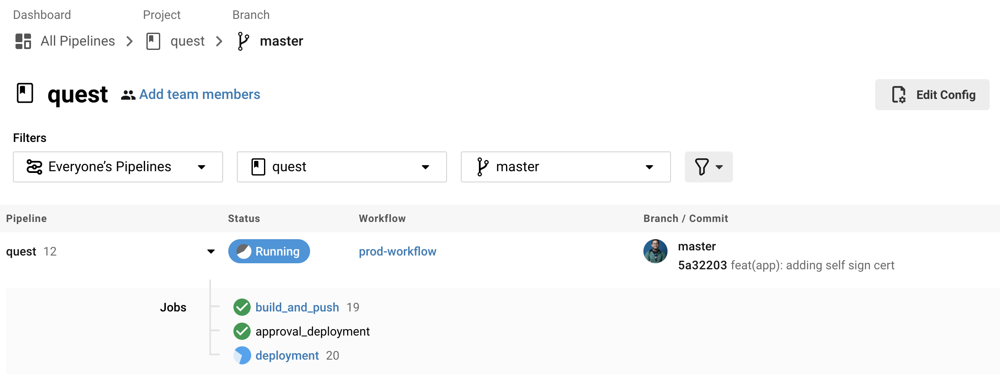
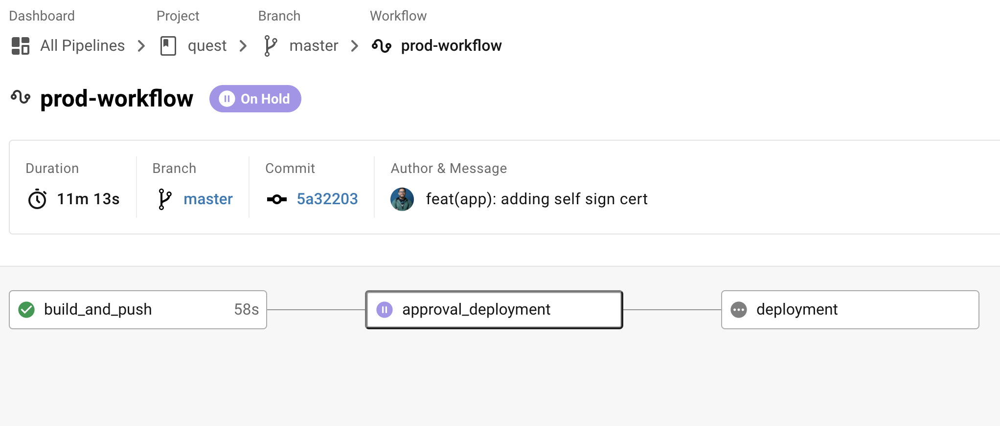
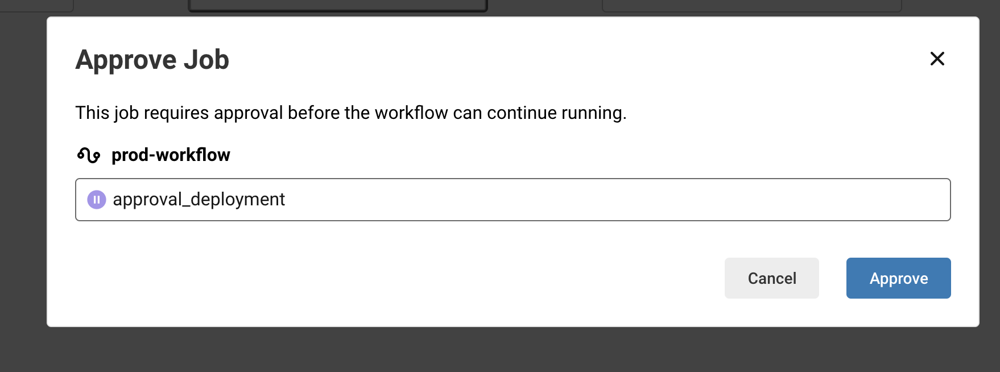
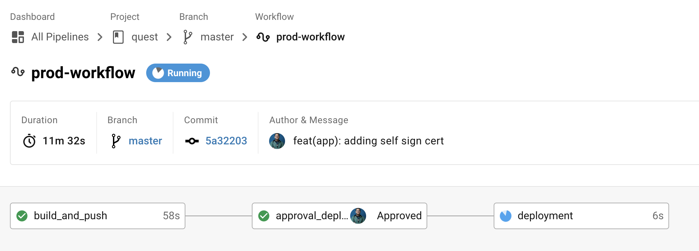
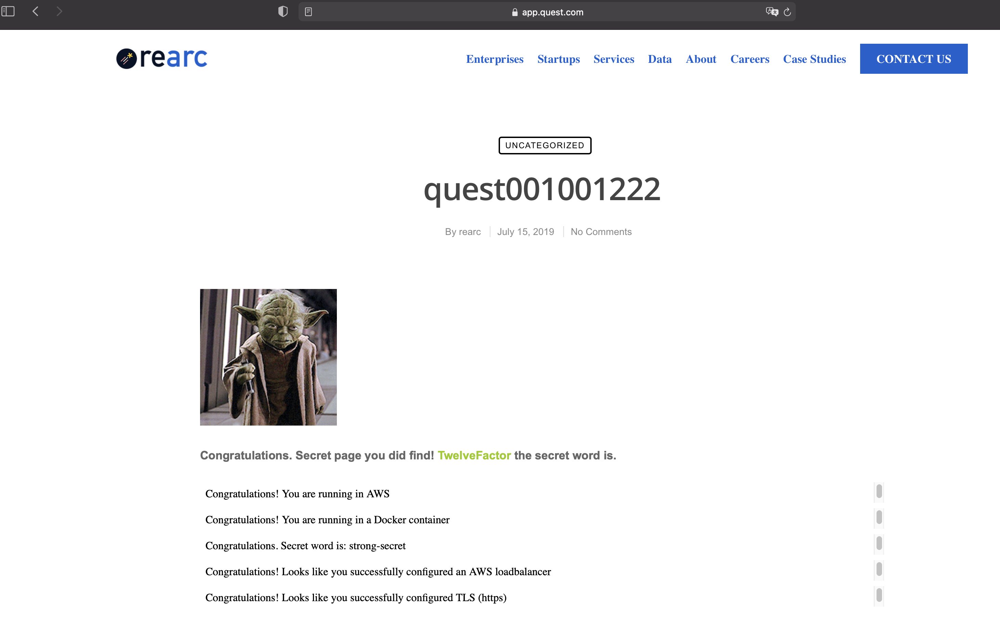
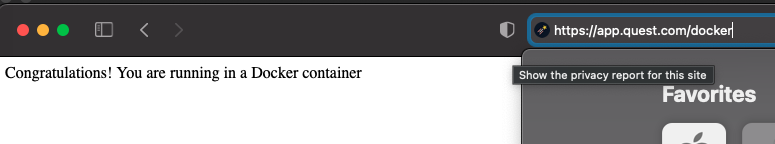
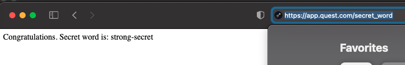
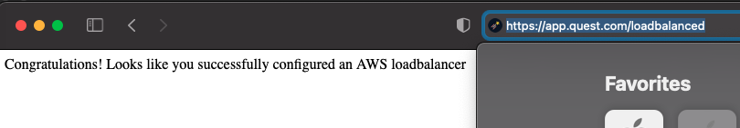
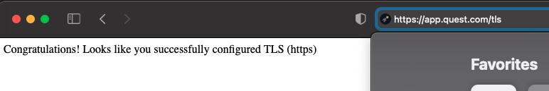

# REARC QUEST by fergo

This quest is using the following components:

1. Node
2. Go
3. Docker
4. Helm
5. Circle CI

## Process

### Code

A feature branch can be created off master and work a feature preview in there. Eventually a PR will be created and merge to Master. 

### CICD powered by Circle CI

Once a new commit is done in master, a Circle CI pipeline called `prod-workflow` will build a docker image using the following parameters:

- AWS Account ID
- AWS Access Keys for circle ci user
- AWS Secret keys for circle ci user
- AWS Region
- AWS ECR name
- Build arguments to set a secret locally
- Environment (which is prod)
- Cluster name
- EKS Namespace

All of these variables are configure in Circle CI context and added to the job as environment variables.



#### Build
The build job is using an orb that build the docker iamge and push it to the required ECR repo

```
aws-ecr/build-and-push-image:
  account-url: AWS_ECR_ACCOUNT_URL
  aws-access-key-id: AWS_ACCESS_KEY_ID
  aws-secret-access-key: AWS_SECRET_ACCESS_KEY
  region: AWS_DEFAULT_REGION
  repo: ${ECR_NAME}
  skip-when-tags-exist: false
  extra-build-args: '--build-arg buildtime_secret="local-strong-secret"'
  tag: '${ENVIRONMENT}-${CIRCLE_SHA1:0:7},${CIRCLE_SHA1:0:7}'
```

#### Approval
There is one step to approve the deployment and can be secure with Github groups




#### Deployment
The deployment job is using orbs for Helm/Helmfile/AWS/Kubectl to get all the context of the cluster and deploy the manifest using Helm + Helmfile

```
IMAGE_TAG=${TAG} K8S_NAMESPACE=${NAMESPACE} helmfile -e ${ENVIRONMENT} -f helm/quest/helmfile.yaml apply
```



# Quest Working!

## App up and running:


## In Docker:


## Secret Word (different from local word):


## Load Balancer:


## TLS:
